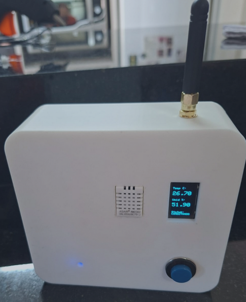
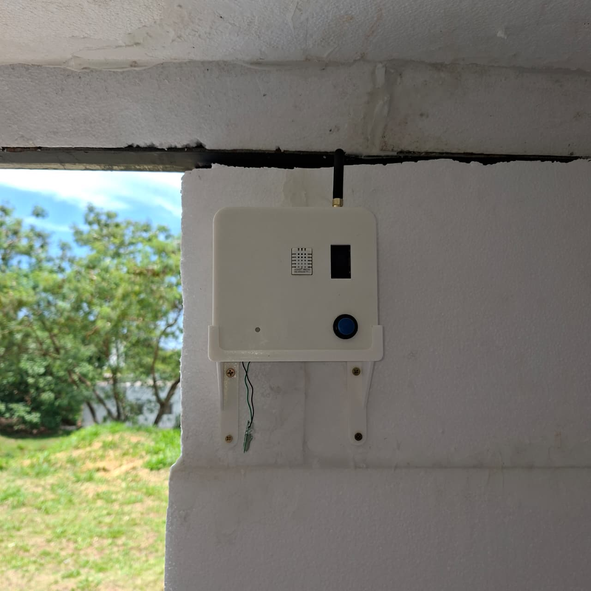

# smartthermo

 

O SmartThermo consiste em uma aplicação em IoT para monitorar temperatura e umidade de um determinado recinto.

O projeto foi desenvolvido para a disciplina de Sistemas Embarcados PPGCOMP - Unioeste.

#### Funcionalidades
- **Monitoranto local:** os dados de temperatura e umidade são exibidos em um display OLED no próprio dispositivo ao pressionar um botão dedicado;
- **Comunicação sem fio:** o dispositivo envia as leituras de forma assíncrona para a rede LoRaWAN com uma frequência de amostragem de 1 minuto;
- **Visualização remota:** os dados do dispositivo podem ser monitorados e analisados através do servidor de aplicação ([LINK]).
- **Autonomia da bateria:** até três dias sem carregamento
----

### Imagens

  
  

